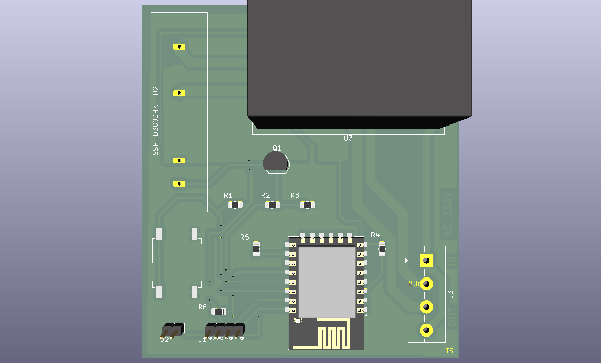

# Motivation

In recent years, there has been a significant rise in the usage of digital devices across all age brackets, whether for work or leisure. Various therapeutic and management approaches have been suggested to address this issue, encompassing optical, medical, and ergonomic interventions.

One common recommendation from clinicians is to take regular breaks to reduce digital eye strain. This advice often includes following the 20-20-20 rule, which suggests taking breaks to focus on an object at least 20 feet (6 meters) away for at least 20 seconds every 20 minutes.

This project serves as a reminder to perform these exercises by toggling your external device on and off, ideally accompanied by a light indicator.

# Hardware 

## Electrical components and flashing
 - ESP8266

[PCB & Flashing](pcb/README.md)
 
# MQTT

## Home assistant

In devices & services add integration and search for MQTT. Add default integration.
In Apps, install app `Mosquitto broker`. Then go to config and add entry to logins.
Add new entry under MQTT and configure device, use `esp32/gpio/set` and switch component.
